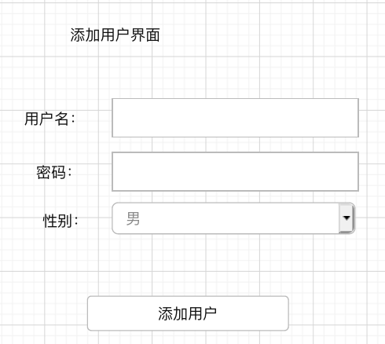
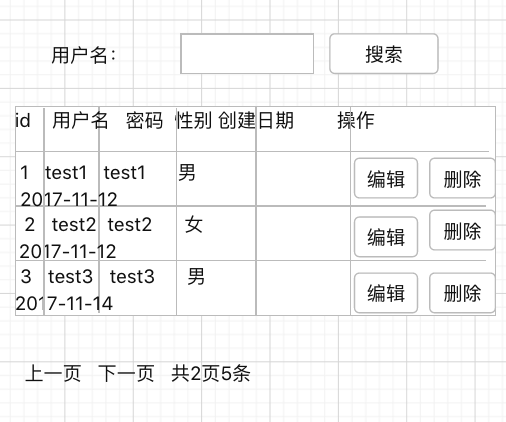
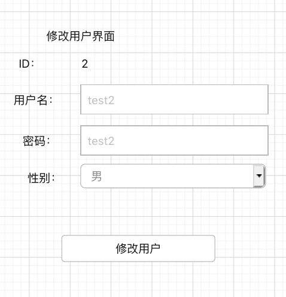

# 面试题
    用自己熟悉的Java 框架，实现一张表（用户表）
    的增加，修改，删除，查询操作，数据库可以用自己熟悉的MySQL或Oracle。
    创建一个用户表 user , 添加 4 个字段
    id  自增长  int
    username 用户名  varchar(30)
    password  密码    varchar(30)
    gender  性别    varchar(2)
    create_at   创建日期   date

## 添加界面

## 展示查询界面

## 修改界面

## 登录界面

## 算法题
    用java 实现一个  split 函数， 输入一个字符串，去掉重复的字符串，去掉前后空格。比如输入一个字符串:  
    a, bb, c, a ,dd  , c   c,  bb
    返回结果是：
    "a" , "bb" , "c" ,"dd" , "c  c"
    java 函数名：
    public List split(String txt){
    //请实现java代码
    }